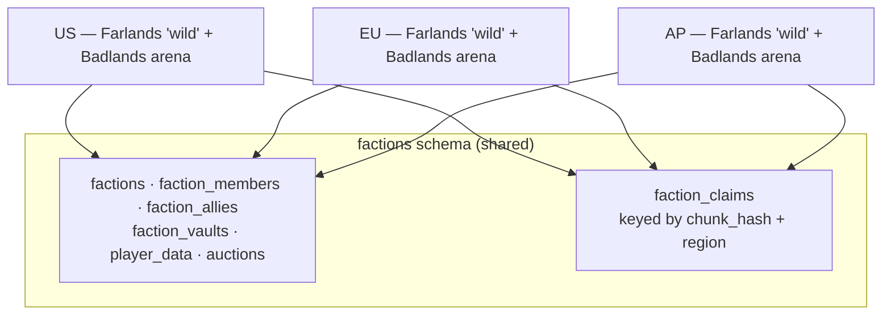

# Factions
Faction warfare — land claiming, power and raiding, faction vaults, bounties, King of the Hill, and generated overworlds.

## About

Factions is a persistent survival gamemode rather than a match-based one. Players form factions, claim chunks of a shared overworld, raid each other, and hold territory — none of which resets between sessions.

Like SkyBlock it keeps no authoritative state of its own: factions, claims, vaults, and player progression all live in MariaDB, and any server can be restarted without losing them. Unlike SkyBlock, worlds do not migrate between servers — a faction's territory belongs to the region it was claimed in.

---

## The Two Game Types

Both run the **same phar**, selected at runtime by the server's game type from the NGEssentials unique id.

|                | **Farlands**                 | **Badlands**                          |
|:---------------|:-----------------------------|:--------------------------------------|
| Game type      | `Farlands`                   | `Badlands`                            |
| Default world  | `wild` — generated overworld | `FactionsPvP` — arena                 |
| Purpose        | Claiming, building, raiding  | Pure PvP                              |
| World autosave | On, flushed hourly           | Off                                   |
| Time of day    | Normal cycle                 | Frozen at midday                      |
| Persistence    | Terrain changes are kept     | Arena resets; nothing is written back |

Farlands is where the gamemode actually lives. Badlands is a combat arena that shares the same faction data — your faction, power, balance and vault follow you into it — but nothing you do to the terrain survives.

`Factions::isBadlands()` is the single branch point, comparing `ServerManager::getGameType()` against `ServerManager::GAME_TYPE_BADLANDS`.

---

## Running It

The [Quick Start](../README.md#quick-start) stack builds Factions and its database in one command:

```bash
GAME=Factions GAME_TYPE=Farlands docker compose up --build
```

Point `ASSETS_PATH` at a checkout of the [assets](https://github.com/NetherGamesMC/assets) repository to get the real `Hub`, `wild`, `FactionsPvP` and `koth` worlds. Without it Farlands generates a fresh `wild` on first boot, which works but starts from empty terrain.

Factions ships its own `server.properties` in [docker/overrides/Factions](../docker/overrides/Factions) for survival gamemode, and uses the chunk-ticking tuned `pocketmine.yml`, since claimed territory keeps a large number of chunks active.

---

## What It Expects

| Requirement           | Detail                                                                                                                                                                                                                                                                                            |
|:----------------------|:--------------------------------------------------------------------------------------------------------------------------------------------------------------------------------------------------------------------------------------------------------------------------------------------------|
| **NGEssentials**      | Soft dependency in practice — Factions returns early from `onEnable` if absent. Supplies player identity, database credentials, chat, regions, and transfers.                                                                                                                                     |
| **libMMO**            | Vendored at `libraries/libMMO`. Supplies economy, auction house, challenges, crates, kits, vaults, enchantments, and entity stacking. `Factions` extends `libMMO\MMOPlugin`.                                                                                                                      |
| **MariaDB 11.4+**     | Credentials come from NGEssentials' `credentials/credentials.yml` under the `fc_database` key, separate from NGEssentials' own `database` block. Schema in [`resources/table_mysql.sql`](resources/table_mysql.sql), queries in [`resources/mysql.sql`](resources/mysql.sql).                     |
| **Stored procedures** | The five files in [`resources/procedures`](resources/procedures) must be loaded into the same schema as the tables. Vault open and close, both economy transactions, and death tracking are all procedure-backed, so a database without them boots fine and fails at the first vault or payment.  |
| **VanillaGenerator**  | Required on Farlands. The `wild` world is generated with the `vanilla_overworld` generator, and the lookup returns null without the plugin, so the server crashes on enable. The heavy lifting is in `ext-vanillagenerator`, which the PM5 PHP build already ships.                               |
| **`ext-leveldb`**     | Worlds are LevelDB. Present in the PM5 PHP build.                                                                                                                                                                                                                                                 |
| **Worlds**            | `Hub`, `wild`, `FactionsPvP` and `koth`, published in the assets repository under `Factions/worlds`, with the original Farlands starting worlds archived under `Factions/archive`. `wild` is the exception — it is generated when absent, so Farlands boots without a map. See [Worlds](#worlds). |
| **Server unique id**  | `region-serverType-gameType-replicaId-deploymentId`, e.g. `US-factions-Farlands--1`. The `region` segment scopes land claims and the `gameType` segment selects Farlands or Badlands.                                                                                                             |
| **Kafka**             | *Optional.* Used only to propagate faction events between servers; see [Degraded Mode](#degraded-mode).                                                                                                                                                                                           |

> [!NOTE]
> Factions is a `customGameServer` in `ServerManager`, so NGEssentials builds a cluster per region and game type rather than treating all Factions servers as interchangeable.

---

## Worlds

Factions loads its worlds by name, and which ones it needs depends on the game type it is running as. What follows is every name it looks for, what it does with each one, and what happens when it is absent.

### What each game type loads

| World         | Farlands           | Badlands           | What it is                                                                                                                                                                                                                                                                            |
|:--------------|:-------------------|:-------------------|:--------------------------------------------------------------------------------------------------------------------------------------------------------------------------------------------------------------------------------------------------------------------------------------|
| `Hub`         | Unloaded at enable | Unloaded at enable | PocketMine's own default world, named by `level-name=Hub` in [docker/overrides/Factions/server.properties](../docker/overrides/Factions/server.properties). Factions replaces the default world with its own and then unloads `Hub`, so it exists only during boot and holds nothing. |
| `wild`        | Default world      | –                  | The claimable overworld. Loaded when it exists, generated from scratch when it does not, and the only world here with autosave on — flushed hourly. Production started it from one of the archived starting worlds published in the assets repository.                                |
| `FactionsPvP` | –                  | Default world      | The arena. Autosave off, time frozen at midday, terrain never written back.                                                                                                                                                                                                           |
| `koth`        | On demand          | On demand          | Loaded when the first player enters a KOTH match, not at boot.                                                                                                                                                                                                                        |

`wild` is the reason VanillaGenerator is a hard requirement on Farlands. When the world is absent Factions generates it with the `vanilla_overworld` generator, and that lookup returns null without the plugin, so the server crashes on enable rather than starting without terrain.

> [!NOTE]
> A Farlands server therefore boots with no map at all, spending a while on spawn chunks before it reports `Done`. What bare generation will not give you is the built spawn — for that, start from one of the [archived Farlands worlds](https://github.com/NetherGamesMC/assets#the-archived-farlands-worlds) in the assets repository.

`FactionsPvP` and `koth` have no such fallback. Neither is ever generated, and both throw rather than degrade: enable fails outright when the arena cannot be loaded, and the first KOTH participant triggers the failure for `koth`. Both need to be in place before a Badlands server is started or KOTH is enabled.

### Where players spawn

Factions is the one gamemode that does not use the hardcoded per-server-type location in `ServerManager::getSpawn()`. It overrides the spawn during enable, taking it from the world's own `level.dat` spawn point, and everything positional is then derived from that:

| Game type | Spawn taken from                            | Facing  |
|:----------|:--------------------------------------------|:--------|
| Farlands  | the `wild` world's `level.dat` spawn        | yaw 270 |
| Badlands  | the `FactionsPvP` world's `level.dat` spawn | yaw 0   |

That location is published two ways — as `Factions::getSpawnLocation()` for the gamemode's own use, and through `ServerManager::setSpawn()` with half a block added on X and Z, so that `/spawn`, `/lobby` and enforcement teleports land on a block's centre rather than its corner.

Everything else is an offset from the same point, applied through `Area::addVectorToLocation()`. The comment in the source puts it plainly: the safe zone is no longer hardcoded and follows whatever spawn point is set.

| Area            | Game type | Extent, relative to the spawn point                                                                                       |
|:----------------|:----------|:--------------------------------------------------------------------------------------------------------------------------|
| Safe zone       | Farlands  | `-192` to `+186` on X, `-28` to `+500` on Y, `-174` to `+135` on Z — deliberately asymmetric, matching the original build |
| War zone        | Farlands  | 550 blocks on X and Z, clamped to Y 0–255, and also resolved to a chunk range for claim checks                            |
| Arena safe zone | Badlands  | 15 blocks on X and Z, 6 on Y                                                                                              |

The three leaderboard floating texts hang at fixed offsets as well — `(-19, 3, -19)`, `(-20, 3, -24)` and `(-20, 3, -14)` on Farlands, `(10, 3, -7.5)`, `(12, 3, 0)` and `(10, 3, 8.5)` on Badlands.

So building your own `wild` comes down to one decision: put its `level.dat` spawn point at the centre of the area you want protected, and the safe zone, war zone, leaderboards and `/spawn` all follow it. Set it badly and the safe zone lands somewhere unhelpful — the plugin will not complain, because as far as it is concerned that is where spawn is.

The single exception is KOTH, which spawns participants at a hardcoded `(1, 67, 0)` facing yaw 180 inside the `koth` world. A KOTH build has to place its objective around that coordinate.

---

## Regions and Claims

Claims are stored per chunk, but scoped by **region** rather than globally:

```sql
faction_claims (chunk_hash BIGINT, server_id VARCHAR(3), faction_id INTEGER,
                UNIQUE (chunk_hash, server_id))
```

`server_id` here is the region code — `US`, `EU` or `AP` — taken from `ServerManager::getServerRegion()`. Each region runs its own Farlands world, so the same chunk coordinates in two regions are two different pieces of land, and a faction can hold territory in each independently.



Faction identity, membership, alliances, balance and vaults are global; only the land is regional.

**Strength** is the faction's power pool, stored on the `factions` row and defaulting to 100. It is gained and drained through combat, and `ClaimManager::getClaimLimit()` turns it directly into a territory allowance — a faction below the threshold can hold no land at all, and every further step of strength buys more claims. That coupling is what makes raiding worth doing: draining a rival's strength shrinks the land they are entitled to.

---

## Faction Vaults

A vault is a shared inventory stored as a blob on the faction row, and only one server may hold it open at a time:

```sql
faction_vaults (faction_id, vault LONGBLOB, server_id, locked_player, last_open,
                FOREIGN KEY (server_id) REFERENCES servers (server_unique_id) ON DELETE SET NULL)
```

Taking and releasing the lock is done through the `faction_vault_open` and `faction_vault_close` stored procedures, so the check and the write happen in one atomic statement: a second server asking for an already-held vault gets back a rejection and the name of the player holding it, rather than racing for the row. The foreign key means an unclean shutdown cannot strand a vault: deleting the server's `servers` row cascades `server_id` back to `NULL` and the lock is gone. On boot Factions additionally clears any lock still carrying its own id, so a server that died mid-edit releases its vaults the moment it comes back.

This is the same recovery shape SkyBlock uses for island placement — the database's own constraints do the cleanup, with no coordinator involved.

---

## Degraded Mode

Factions publishes faction events — strength changes and similar — through libMMO's `EventEmitter`, which rides on Kafka. With `kafkaEnabled: false` the emitter logs a notice and turns publishes into no-ops, which is correct for a single server: there are no peers to notify, and every value it would announce has already been committed to MariaDB.

Everything else works without Kafka, because it is all database-backed: factions, claims, vaults, power, bounties, economy, auction house, crates, kits, and KOTH.

What does not work is cross-server movement. NGEssentials hands players between servers over a Kafka topic, and its matchmaking is stubbed in this open-source release, so the region and server selector forms cannot move anyone. A single Factions server runs fine; a multi-region deployment needs that transfer path restored first.

> [!NOTE]
> That limitation lives in NGEssentials' transfer path, not in Factions, and affects every gamemode in this repository that transfers players.
