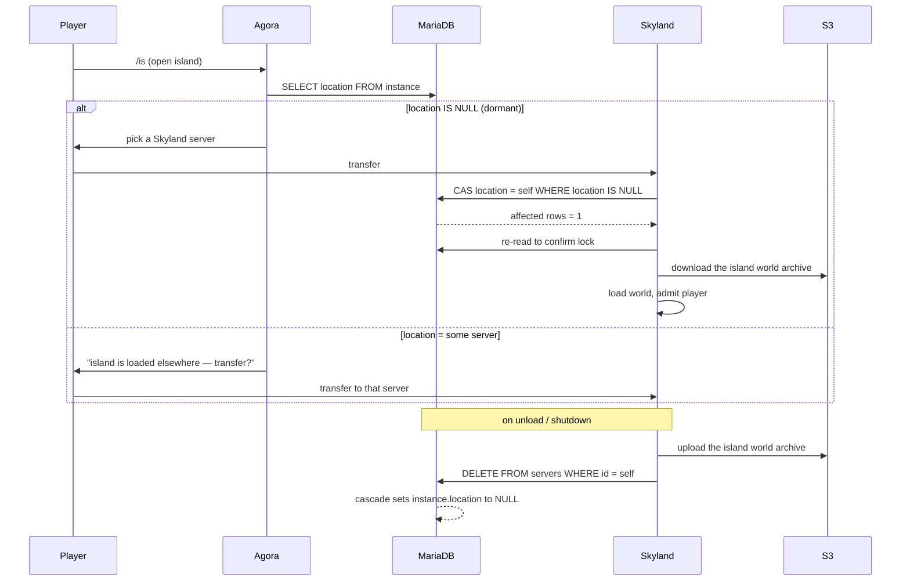

# SkyBlock

Persistent island survival — challenges, crates, auction house, custom enchantments, spawner stacking, and island bosses.

## About

Unlike the arena minigames in this repository, SkyBlock has no match lifecycle and ships no per-match arenas. Player islands are long-lived worlds that migrate between servers on demand.

The plugin is **stateless**. A SkyBlock server holds no authoritative data of its own — every fact that outlives a session lives in MariaDB or in object storage. Any server can be killed at any moment and the cluster stays consistent.

---

## The Two Modes

Both modes run the **same phar**. The mode is decided at runtime by the server's *game type*, read from the NGEssentials server unique id — nothing in the build or the image differs between them.

|                    | **Agora**                       | **Skyland**                       |
|:-------------------|:--------------------------------|:----------------------------------|
| Game type          | `Agora`                         | `Skyland`                         |
| Purpose            | Social hub and PvP              | Island hosting                    |
| Worlds loaded      | `pvp`, hub, NPCs                | `Island-<xuid>` per active island |
| Player interaction | Chat, trade, auction house, PvP | Mostly solo and visitors          |
| Load profile       | Many players, few worlds        | Few players, many worlds          |

The split exists so that island world load never competes with player load. A hundred players brawling in Agora cannot slow down island generation, and a server streaming thirty island worlds off S3 is not also ticking a PvP arena.

`SkyBlock::isAgora()` is the single branch point; it compares `ServerManager::getGameType()` against `ServerManager::GAME_TYPE_AGORA`.

> [!NOTE]
> A Skyland server runs perfectly well on its own. Players without an island are offered the island creation form on the spot rather than being transferred to Agora, so no second server is needed for development.

---

## Running It

The [Quick Start](../README.md#quick-start) stack builds SkyBlock, its database, and a local [RustFS](https://github.com/rustfs/rustfs) instance for island storage in one command:

```bash
GAME=SkyBlock GAME_TYPE=Skyland COMPOSE_PROFILES=skyblock docker compose up --build
```

`COMPOSE_PROFILES=skyblock` is what starts object storage; without it the server boots but island loading fails. Point `ASSETS_PATH` at a checkout of the [assets](https://github.com/NetherGamesMC/assets) repository to get the real `Hub`, `pvp` and `arena` worlds along with the starter island templates.

SkyBlock ships its own `server.properties` and `pocketmine.yml` in [docker/overrides/SkyBlock](../docker/overrides/SkyBlock), which is how it gets survival mode instead of the shared adventure-mode default. Building the phar on its own is covered in the [monorepo README](../README.md#building-a-plugin-with-docker).

---

## What It Expects

| Requirement               | Detail                                                                                                                                                                                                                                                                                                                                                                                                                                                                                                                                                                      |
|:--------------------------|:----------------------------------------------------------------------------------------------------------------------------------------------------------------------------------------------------------------------------------------------------------------------------------------------------------------------------------------------------------------------------------------------------------------------------------------------------------------------------------------------------------------------------------------------------------------------------|
| **NGEssentials**          | Soft dependency, but effectively mandatory — SkyBlock returns early from `onEnable` if absent. Supplies player identity, database credentials, chat, friends, and transfers.                                                                                                                                                                                                                                                                                                                                                                                                |
| **libMMO**                | Vendored at `libraries/libMMO`. Supplies economy, auction house, challenges, crates, kits, vaults, enchantments, and entity stacking. `SkyBlock` extends `libMMO\MMOPlugin`.                                                                                                                                                                                                                                                                                                                                                                                                |
| **MariaDB 11.4+**         | The authoritative store — MariaDB specifically, not MySQL: the NGEssentials dump uses the MariaDB-only `utf8mb4_uca1400_as_ci` collation, and MySQL 8 additionally rejects this schema's `BLOB UNIQUE` and bare `BLOB DEFAULT ''` declarations. Credentials come from NGEssentials' `credentials/credentials.yml` (`database` for NGEssentials, `sb_database` for SkyBlock). Schema in [`resources/table_mysql.sql`](resources/table_mysql.sql), queries in [`resources/mysql.sql`](resources/mysql.sql); the filenames and libasynql's `mysql` driver name are historical. |
| **S3-compatible storage** | Island world archives, stored as `<prefix><xuid>.ngzstd`. Configured by `S3_BUCKET`, `S3_ACCESS_KEY`, `S3_SECRET_KEY`, `S3_REGION` and `S3_ENDPOINT` environment variables in production; the `s3:` block in `resources/config.yml` is read **only** when NGEssentials runs in development mode.                                                                                                                                                                                                                                                                            |
| **Worlds**                | `Hub`, `pvp`, `sb-arena` and `arena`, published in the assets repository under `SkyBlock/worlds`. Only `Hub` has a fallback when absent. See [Worlds](#worlds) for what each one is for, and for running maps of your own.                                                                                                                                                                                                                                                                                                                                                  |
| **Island templates**      | `SkyBlock/DefaultIslands` in the assets repository, installed to `plugin_data/NGSkyBlock/DefaultIslands` as one directory per island type. A new island is created by copying the template named in `Island::SKY_BLOCK_DATA`, so Skyland cannot create islands without at least one. See [Worlds](#worlds).                                                                                                                                                                                                                                                                 |
| **`ext-leveldb`**         | Island worlds are LevelDB. Present in the PM5 PHP build.                                                                                                                                                                                                                                                                                                                                                                                                                                                                                                                    |
| **Server unique id**      | `region-serverType-gameType-replicaId-deploymentId`, e.g. `US-sb-Skyland--1`. The `gameType` segment selects Agora or Skyland. Derived from `POD_NAME` under Kubernetes; otherwise assembled from the NGEssentials config plus the `SERVER_REGION`, `GAME_TYPE` and `SERVER_ID` environment variables. Must fit `VARCHAR(32)` — it is a foreign key.                                                                                                                                                                                                                        |
| **`POD_IP`**              | *Optional.* Supplies the snowflake machine id. When unset it falls back to this host's own address, which is correct for a single instance; set it explicitly when running several instances on one machine, or they will derive the same id.                                                                                                                                                                                                                                                                                                                               |
| **Kafka**                 | *Optional.* See [Degraded Mode](#degraded-mode) below.                                                                                                                                                                                                                                                                                                                                                                                                                                                                                                                      |

> [!IMPORTANT]
> The S3 client in `libasyncio` hardcodes `https://`, so any endpoint must serve TLS. Peer verification is disabled but the hostname is still checked, which is why the development stack issues a certificate matching its service name.

---

## Worlds

SkyBlock loads its worlds by name, and which ones it needs depends on the mode it is running as. What follows is every name it looks for, what it does with each one, and what happens when it is absent — enough to install the published maps with confidence, or to build your own.

Worlds live in `worlds/` inside the server data directory, which the development stack mounts from the host. All of them are LevelDB, which is what `ext-leveldb` in the PM5 build is for.

### What each mode loads

| World                   | Agora            | Skyland      | What it is                                                                                                                                                                                                                                                                                                                                                                                         |
|:------------------------|:-----------------|:-------------|:---------------------------------------------------------------------------------------------------------------------------------------------------------------------------------------------------------------------------------------------------------------------------------------------------------------------------------------------------------------------------------------------------|
| `Hub`                   | Lobby            | Landing area | PocketMine's own default world, named by `level-name=Hub` in [docker/overrides/SkyBlock/server.properties](../docker/overrides/SkyBlock/server.properties). SkyBlock never calls `setDefaultWorld()`, so this stays the default world for the life of the process. Agora stands its NPCs here; Skyland only passes through it, because players are moved to their island as soon as one is loaded. |
| `pvp`                   | Loaded at enable | –            | The Agora PvP arena, loaded in `SkyBlock::onEnable()` and reached with `/pvp`.                                                                                                                                                                                                                                                                                                                     |
| `sb-arena`              | On demand        | –            | The world behind `/arena`. Its enable-time load is commented out, so it has to be loaded already or the command finds nothing.                                                                                                                                                                                                                                                                     |
| `arena`                 | –                | Template     | Copied to `IslandUpgrade-<owner>` for a boss level-up rather than entered directly.                                                                                                                                                                                                                                                                                                                |
| `DefaultIslands/<Name>` | –                | Template     | The seven island templates, installed under `plugin_data/NGSkyBlock/DefaultIslands`.                                                                                                                                                                                                                                                                                                               |
| `Island-<xuid>`         | –                | Runtime      | Created by copying a template, archived to S3, restored from it. Never authored by hand.                                                                                                                                                                                                                                                                                                           |
| `backup_island_check`   | –                | Maintenance  | Scratch world used by the recursive island audit.                                                                                                                                                                                                                                                                                                                                                  |

Only `Hub` is forgiving. When it is missing PocketMine generates one from `level-type=DEFAULT` and the server boots normally, which is exactly what a clean development stack does. The rest are never generated: `getWorldByName()` returns null and the feature that wanted the world fails when somebody uses it rather than at boot, so a server can look healthy and still have a broken `/pvp`.

### Where players spawn

SkyBlock does not take the spawn from the world. `ServerManager::getSpawn()` holds a hardcoded location per server type, and the `sb` arm is `(7.5, 99, -3.5)` facing yaw 315, in whichever world is currently the default. Up to one block of random offset is added on X and Z so that players arriving together do not stack in the same spot.

SkyBlock never calls `ServerManager::setSpawn()`, so that constant always wins and the `Hub` world's own `level.dat` spawn point is ignored. A lobby you build yourself therefore needs standing ground at `(7.5, 99, -3.5)`, or players will spawn inside terrain and fall. If that does not suit your map, change the `self::SB` arm of the match in [ServerManager.php:708](../NGEssentials/src/NetherGames/NGEssentials/ServerManager.php#L708) — it is the only place the value comes from.

Island spawns work the other way around, and are per island rather than per server. [`Island::getSpawnPosition()`](src/skyblock/islands/Island.php#L486) returns the spawn the owner set for themselves, and falls back to the island world's `level.dat` spawn point when they never set one. Owners set it from the island form, which stores their current position with the yaw rounded to the nearest 45 degrees. A template's `level.dat` spawn is therefore where every new owner of that template first lands, so it is worth placing deliberately when authoring one.

The island helper NPC is positioned separately, by absolute coordinates baked into `Island::SKY_BLOCK_DATA`:

| Template  | Directory   | NPC spawn     | Permission to pick it    |
|:----------|:------------|:--------------|:-------------------------|
| Scrubland | `Scrubland` | `-11, 93, -2` | none — the default       |
| Snowy     | `Snowy`     | `2, 59, 6`    | none                     |
| Desert    | `Desert`    | `-3, 94, 1`   | `nethergames.vip.ultra`  |
| Greek     | `Greek`     | `-5, 95, -9`  | `nethergames.vip.ultra`  |
| Modern    | `Modern`    | `7, 94, 7`    | `nethergames.vip.ultra`  |
| Town      | `Town`      | `-8, 93, 5`   | `nethergames.vip.ultra`  |
| Jungle    | `Jungle`    | `12, 102, 17` | `nethergames.vip.legend` |

The directory name is not free-form — it is the `MAP_NAME` value in that array, used directly as the path the template is copied from. If you author a template with different geometry, update its `MAP_NPC_SPAWN` entry too, or the helper NPC ends up buried in the build.

---

## How State Moves Between Servers

Three independent channels, in descending order of importance.

### MariaDB — placement and player state

Three tables carry everything that matters:

- **`servers`**: One row per live server, keyed by unique id. A row's existence *is* the liveness signal, and both other tables reference it with `ON DELETE SET NULL`, so deleting a server's row atomically releases everything it was holding.
- **`instance`**: One row per island. `location` points at the server currently hosting it, or `NULL` when the island is dormant. `package` holds island metadata and `public` controls visitability.
- **`player_data`**: Money, bank, inventory, XP, challenge progress, bounty, crate keys, and vaults. `server_online` points at the server the player is currently on.

Because the foreign keys cascade, cleanup is automatic and needs no coordinator. There is no service that reconciles state; the database's own constraints do it.

### S3 — island world bodies

An island is a PocketMine world directory named `Island-<xuid>`. On claim, the hosting server pulls the archive from the bucket and loads it; on release it compresses and uploads it back. Only the *pointer* lives in MariaDB — the world bytes never pass through the database.

### Kafka — cache invalidation only

libMMO's `EventEmitter` publishes to topic `mmo_server-<serverType>` with key `<deploymentId>-<notificationId>-<channel>`; senders ignore their own messages by comparing the deployment id segment.

It carries exactly three notifications — `BOUNTY`, `MONEY`, `BANK` — plus rollback events. Every one of these refers to a value **already committed to MariaDB**. The message only tells a peer holding that player online to re-read the row and refresh their scoreboard, which makes Kafka a latency optimisation and never a source of truth.

---

## Island Handoff

The claim is an atomic compare-and-swap in SQL, re-read to confirm, in a retry loop ([`IslandManager.php`](src/skyblock/islands/IslandManager.php)):

```sql
UPDATE instance SET location = IF(location IS NULL, ?, location) WHERE owner = ?
```

Only one server can win, whatever the race. A losing server sees `location` set to somebody else and reports the island as already loaded, then offers to transfer the player there instead.



On boot, `MMOPlugin` deletes its own `servers` row **before** inserting it. If the server previously died without running `onDisable`, that delete cascades every island it was holding back to `location = NULL`, releasing them for other servers to claim. Recovery is a side effect of starting up — there is nothing to run by hand.

The cost of an unclean shutdown is bounded by the same rule: islands are released, but any world state since the last S3 upload is lost, because the upload happens on unload.

---

## Degraded Mode

`EventEmitter` tolerates NGEssentials running with `kafkaEnabled: false`. It logs a notice, skips topic subscription, and turns publishes into no-ops, with `isDistributed()` reporting which mode is active. This is correct for a single-server deployment: with no peers there is nobody to invalidate, and the local server's own writes already went to MariaDB.

Islands, economy, auction house, challenges, crates, vaults, trading, persistence, and crash recovery all keep working, because every one of them is MariaDB- and S3-backed.

Two things do not work without Kafka, and neither originates in SkyBlock or libMMO — both live in NGEssentials' transfer path and affect every game in this repository that transfers players:

- **Cross-server transfers**: NGEssentials hands the player's data to the destination over a Kafka topic and only sends the WaterdogPE `TransferPacket` once the destination acknowledges. With Kafka off the publish is a silent no-op, the acknowledgement never arrives, and the player is left invisible and frozen, since `forceTransfer` marks them invisible immediately after publishing and passes no timeout handler.
- **Matchmaking**: `ServerManager::findBestServer` is stubbed in this open-source release and always reports "Matchmaking is currently unavailable", so any transfer without an explicit target server id fails. This also affects `/lobby` and `/hub`.

In other words, a **single** SkyBlock server runs fine without Kafka — which is exactly what the development stack provides — but an Agora and Skyland **pair** cannot move players between them until the transfer path is given a non-Kafka fallback.
